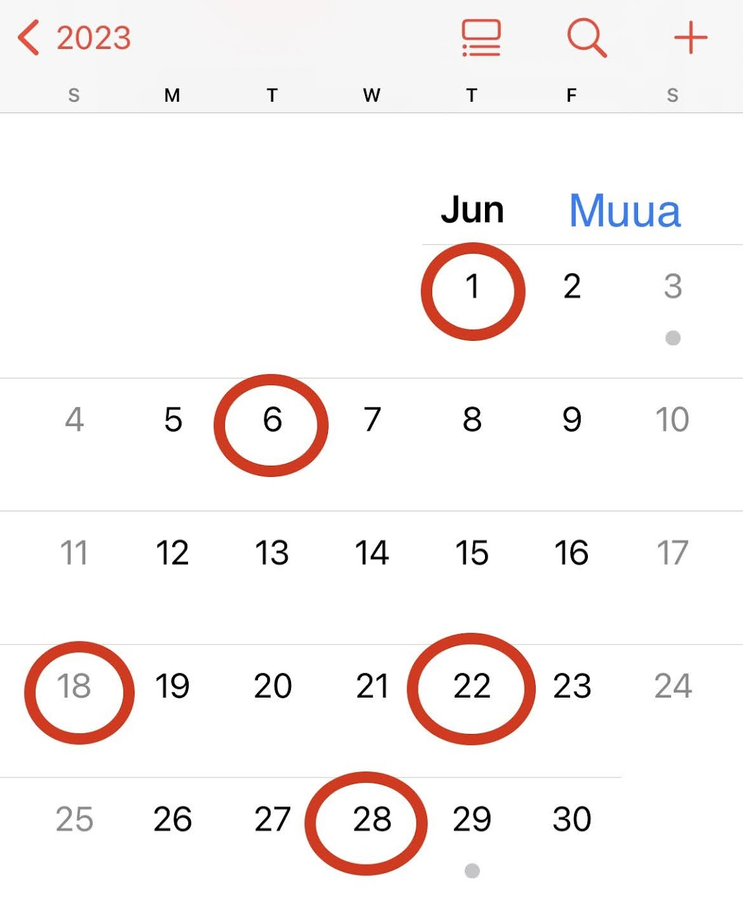

Mời các bạn tham khảo danh sách các ngày nghỉ lễ, các ngày đặc biệt và ngày kỷ niệm, sự kiện trong tháng 4, 5, 6 để thực hiện các chương trình thúc đẩy doanh số quý 2 nhé? 
Những ngày bôi đậm là những ngày phổ biến được nhiều người tổ chức kỷ niệm.
# Tháng 4
1. **Ngày Cá Tháng Tư (1/4)**
2. Ngày Thế Giới Nhận Thức Về Tự Kỷ (2/4)
3. Ngày lặp (4/4)
4. Ngày Sức Khỏe Thế Giới (7/4)
5. Ngày Valentine Đen (14/4)
6. Ngày Sách Việt Nam (21/4)
7. Ngày Trái Đất (22/4)
8. Ngày Sách Và Bản Quyền Thế Giới (23/4)
9. Ngày Thế Giới Phòng Chống Sốt Rét (25/4)
10. Ngày Sở Hữu Trí Tuệ Thế Giới (26/4)
11. **Ngày Giỗ Tổ Hùng Vương (10/3 âm lịch, và 29/4 dương lịch) (ngày nghỉ)**
12. **Ngày Giải Phóng Miền Nam, Thống Nhất Đất Nước (30/4) (ngày nghỉ)**

# Tháng 5

1. **Ngày Quốc Tế Lao Động (1/5)  (ngày nghỉ)**
2. Ngày Tự Do Báo Chí Thế Giới (3/5)
3. Ngày Chiến Thắng Điện Biên Phủ (7/5)
4. **Ngày Của Mẹ (chủ nhật thứ 2 của tháng 5, vào 14/5/2023)**
5. Ngày Thành Lập Đội Thiếu Niên Tiền Phong Hồ Chí Minh (15/5)
6. Ngày Quốc tế Điều dưỡng (12/5)
7. Ngày Quốc Tế Gia Đình (15/5)
8. Ngày Quốc tế chống kỳ thị, phân biệt đối xử với người đồng tính, song tính và chuyển giới (IDAHOT - International Day Against Homophobia and Transphobia) (17/05): Ở các nước thường tổ chức lễ hội Pride Day để tôn vinh các vẻ đẹp khác biệt.
9. Ngày Sinh Của Chủ Tịch Hồ Chí Minh (19/5)
10. Ngày Thế giới về Đa dạng Văn hoá vì Đối thoại và Phát triển (World Day for Cultural Diversity for Dialogue and Development) (21/05)
11. Ngày Quốc tế Đa dạng sinh học (International Day for Biological Diversity) (22/05)
12. Ngày Quốc tế Gìn giữ Hòa bình Liên Hợp Quốc (International Day of UN Peacekeepers) (29/05).
13. Ngày Thế giới Không Thuốc lá (World No-Tobacco Day) (31/05).

# Tháng 6
Tham khảo: *Ý tưởng thúc đẩy doanh số hè tháng 6 2023*

1. **Ngày Quốc Tế Thiếu Nhi (1/6)**
2. Ngày Môi Trường Thế Giới (5/6)
3. Ngày Đại Dương Thế Giới (8/6)
4. Ngày Thế Giới Phòng Chống Lao Động Trẻ Em (12/6)
5. Ngày Hiến Máu Thế Giới (14/6)
6. **Ngày Của Cha (chủ nhật thứ 3 của tháng 6, 18/06/2023)**
7. Ngày Báo Chí Cách Mạng Việt Nam (21/6)
8. **Ngày Gia Đình Việt Nam (28/6)**

Trên đây là một số ngày quan trọng mà bạn có thể đưa vào các ý tưởng tổ chức một số sự kiện hoặc chiến dịch tương tác khách hàng trong quý 2. Hãy lưu vào lịch tồn kho và đưa các khuyến mại độc đáo trên cửa hàng trực tuyến Muua của mình để không bỏ lỡ cơ hội tăng doanh số nhé? 
Đừng quên tham khảo *một số ví dụ để tăng doanh số bán hàng trong mùa hè nóng bỏng 2023*. 

# Thành công của bạn là thành công của chúng tôi

Muua tự hào là một công ty luôn đặt doanh nghiệp bản địa lên hàng đầu. Cuối cùng, các bạn là lý do tại sao chúng tôi tồn tại. Chúng tôi đang trong sứ mệnh chuyển đổi số cho các doanh nghiệp trong việc chấp nhận đặt hàng trực tuyến. Nếu bạn sẵn sàng đăng ký thử nghiệm miễn phí, hãy tạo cửa hàng trực tuyến của bạn [tại đây](https://muua.com.vn/), chỉ mất vài phút.

# Nguồn: 
Bài viết được chuyên gia marketing của Muua tổng hợp và triển khai. Vui lòng ghi rõ nguồn nếu sử dụng lại.