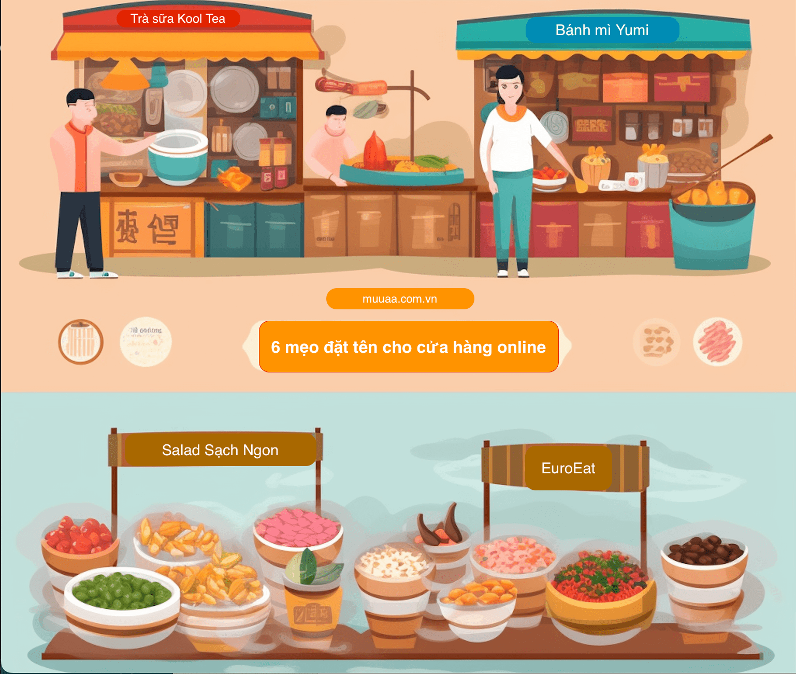

# 6 Mẹo Đặt Tên Cho Cửa Hàng Trực Tuyến Ấn tượng

Cái tên rất quan trọng. Đó là cách chúng ta giới thiệu bản thân và tạo ấn tượng ban đầu. Vì thế việc nghĩ về tên thương hiệu cửa hàng của bạn là điều cần thiết nếu bạn nghiêm túc muốn xây dựng một doanh nghiệp trực tuyến.

Ở đây, chúng tôi sẽ giới thiệu một số mẹo tốt nhất để giúp bạn lựa chọn một tên thương hiệu từ danh sách tiềm năng của bạn và chọn một cái tên để giúp bạn nổi bật giữa đám đông!

## 1. Ngắn gọn và bắt mắt

Một cái tên thương hiệu tuyệt vời là cái tên mà người ta khó quên. Các tên thương hiệu gây ấn tượng và dễ nhớ giúp thương hiệu của bạn nổi bật. Điều này đặc biệt quan trọng đối với các doanh nghiệp mới. Hãy chọn một cái tên ngắn gọn và gây chú ý để tạo dựng ấn tượng mạnh mẽ.
Ví dụ:

- **Sendo**: Một trang web thương mại điện tử nổi tiếng tại Việt Nam với cái tên ngắn gọn và dễ nhớ.
- **Tiki**: Một nền tảng mua sắm trực tuyến phổ biến với một cái tên ngắn và gây chú ý.

## 2. Xem xét cá tính thương hiệu (persona)

Chọn một cái tên thương hiệu phản ánh cá tính đặc trưng của bạn giúp xây dựng hình ảnh thương hiệu trong tâm trí khách hàng. Hãy suy nghĩ về cá tính và giá trị mà thương hiệu của bạn muốn truyền tải và lựa chọn một cái tên phù hợp.
Ví dụ:

- ##The Coffee House\*\*: Một chuỗi cửa hàng cà phê phổ biến tại Việt Nam với một cái tên đơn giản và thân thiện.
- **Biti's**: Một thương hiệu giày dép nổi tiếng với một cái tên gắn liền với sự thoải mái và phong cách.

## 3. Chọn cái bền vững, không theo trào lưu

Chọn một cái tên thương hiệu bền vững và không bị ảnh hưởng bởi các trào lưu thời thượng. Điều này giúp thương hiệu của bạn tồn tại lâu dài và không bị lỗi thời.
Ví dụ:

- **Trung Nguyên**: Một thương hiệu cà phê nổi tiếng với một cái tên đơn giản và không bị ảnh hưởng bởi các trào lưu hiện tại.
- **Vinamilk**: Một thương hiệu sữa hàng đầu tại Việt Nam với một cái tên chủ động và không theo trào lưu.

## 4. Hiểu về khách hàng

Trước khi lựa chọn tên thương hiệu, hãy hiểu về khách hàng của bạn và lĩnh vực bạn hoạt động. Tùy thuộc vào kiến thức và quan tâm của khách hàng, bạn có thể chọn một cái tên trừu tượng hoặc liên quan trực tiếp đến sản phẩm hoặc dịch vụ của bạn.
Ví dụ:

- **Viettel**: Một nhà cung cấp dịch vụ viễn thông hàng đầu với một cái tên đơn giản và trực tiếp.
- **Zalo**: Một ứng dụng nhắn tin và gọi điện phổ biến với một cái tên trừu tượng.

## 5. Đơn giản và dễ hiểu

Các tên doanh nghiệp mô tả ngành nghề hoạt động có thể giúp khách hàng hiểu rõ ngay từ cái nhìn đầu tiên. Lựa chọn một cái tên đơn giản và dễ hiểu để truyền đạt thông điệp rõ ràng và thu hút khách hàng.

Ví dụ:

- **Nhà sách FAHASA**: Một chuỗi nhà sách phổ biến với một cái tên nói lên ngành nghề hoạt động của họ (3 chữ đầu tiên của Phát Hành Sách).
- **Tạp chí Forbes Việt Nam**: Một tạp chí kinh doanh hàng đầu với một cái tên chỉ ra mục tiêu của họ.

# 6. Kiểm tra tính khả dụng của tên miền

Khi bạn đã chọn một cái tên thương hiệu, hãy kiểm tra tính khả dụng của tên miền để đảm bảo rằng bạn có thể sở hữu tên miền tương ứng cho trang web của mình. Bạn có thể tra tên không dấu **ten**.muua.com.vn để kiểm tra xem tên còn không? Sở hữu một tên miền riêng giúp xây dựng hình ảnh thương hiệu và độ tin cậy cho doanh nghiệp của bạn.

Ví dụ:

- **Tiki.vn**: Một trang web mua sắm trực tuyến phổ biến với tên miền phù hợp với tên thương hiệu của họ.
- **Shopee.vn**: Một nền tảng thương mại điện tử hàng đầu với một tên miền tương ứng.

Nhớ rằng việc chọn tên thương hiệu là một quá trình quan trọng. Hãy đảm bảo bạn suy nghĩ kỹ càng và lựa chọn một cái tên phù hợp với thương hiệu của bạn để nổi bật và thành công trong thị trường trực tuyến.

# Thành công của bạn là thành công của chúng tôi

Muua tự hào là một công ty luôn đặt doanh nghiệp bản địa lên hàng đầu. Cuối cùng, các bạn là lý do tại sao chúng tôi tồn tại. Chúng tôi đang trong sứ mệnh chuyển đổi số cho các doanh nghiệp trong việc chấp nhận đặt hàng trực tuyến. Nếu bạn sẵn sàng đăng ký thử nghiệm miễn phí, hãy tạo cửa hàng trực tuyến của bạn [tại đây](https://muua.com.vn/), chỉ mất vài phút.

# Nguồn:

Bài viết được chuyên gia marketing của Muua tổng hợp và triển khai. Vui lòng ghi rõ nguồn nếu sử dụng lại.
