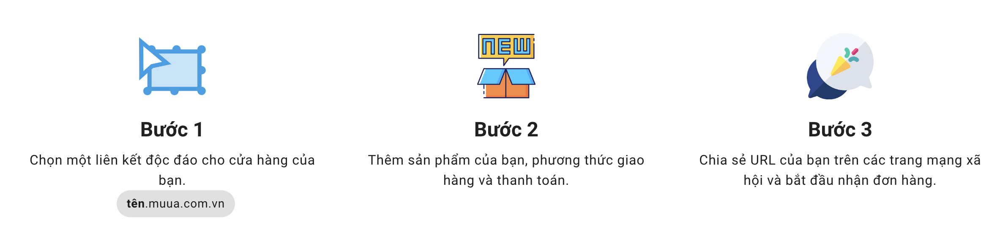

## ⚡️ Bước 1  
Chọn một liên kết độc đáo cho tên cửa hàng của bạn 
**Tencuahang**.muua.com.vn
Ví dụ: huebakery (Huệ's bakery vì mình bán bánh sinh nhật)

Tham khảo: *6 Mẹo Đặt Tên Hoàn Hảo Cho Cửa Hàng Trực Tuyến Ấn tượng*

## 🖼 Bước 2
Thêm sản phẩm, phương thức vận chuyển và thanh toán.
Ví dụ: **Sản phẩm** là bánh sinh nhật (với biến thể là cỡ 12m giá 80k, cỡ 14cm giá 120k và 16cm giá 150k). Có thể thêm bánh su kem 30k/ hộp. Thêm bánh bông lan trứng muối giá 60k.

**Phương thức vận chuyển** thường là Tới nhận hàng hoặc Giao hàng. Bạn có thể tính phí giao hàng hoặc miễn phí nếu tiện trong phạm vi địa lý nhất định. 

**Thanh toán** có thể bằng tiền mặt hoặc chuyển khoản ngân hàng hoặc ví, và các phương thức khác.  

Tham khảo: 
- *15 chiến lược giá* 
- *Định giá theo tâm lý khách hàng*

## 🎉 Bước 3  
Chia sẻ đường dẫn trên các mạng xã hội và bắt đầu nhận đơn hàng. 
Chỉ cần gửi đường dẫn cho khách hàng đang muốn đặt hoặc đính kèm trong bài viết, hoặc kèm link ngắn trong poster quảng cáo.

Vậy là bạn đã có thể chốt đơn rồi! 